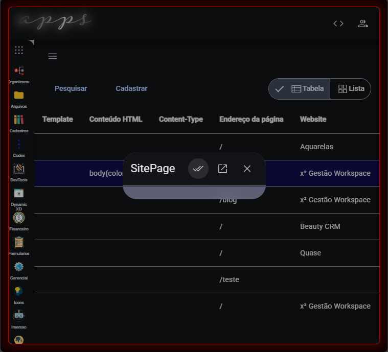

# Changelog
---
este arquivo é enviado periodicamente
 - [ ]: Compartilhar em App/Formulários, permitir criar link público ou privado para compartilhamento do formulário para apresentação ou edição;


 ### TASK [2025/2] Implementações no Acesso e Registro da Aplicação
 - [✔️]: Refresh Token deve ser validado com argon2 ... este processo foi obfuscado;
 - [✔️][FALHA]: Ao executar `node deploy` ocorre falha ao copiar todos os arquivos da distribuição; 
 - [✔️] Implementação de App CodeX para edição de código-fonte ;
 ---
 ### TASK [2025/1] Implementação de Refresh Token por Credenciais de Acesso

 Transportar o Refresh Token para camada de acesso, assim permitindo multiplas conexões em uma mesma conta, de modo que cada conexão tenha um RefreshToken Isolado e revogável por parte do serviço de autenticação;

```md
Dificuldade: 3
Tempo planejado: 5 horas
Tempo decorrido:  
Responsável: plhx
100% [xxxxxx]
```

# Problemas Identificados no período

## Erro: Problema ao visulizar formulário de edição
Motivo: à identificar.
Prioridade alta. Afeta todas as janelas de edição de quaisquer dados;


 ---

Ajustes em modelo de `Aplicação`. Adicionado relações de Usuários com A aplicacação. Lista de Usuários Administradores da Aplicação;