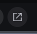

# Abrir objeto em janela externa a partir do (internalId)

Status: Não iniciado
Especificação: draft

# Descrição Geral
Abrir em janela externa deve estar disponível apenas quando objeto data estiver.

Ao acionar deve abrir o objeto em janela externa a partir da rota da aplicação indicando o internalId na rota da aplicação.